# ソーシャルログイン@SpringSecurity

<details open="open">
<summary>目次</summary>


- [環境セットアップ](#環境セットアップ)
- [ログインの流れ](#ログインの流れ)
- [コードの説明](#コードの説明)
  - [applicaton.yml](#applicaton.yml)
  - [SecurityConfiguration.kt](#SecurityConfiguration.kt)
  - [CommonAuthenticationSuccessHandler.kt](#CommonAuthenticationSuccessHandler.kt)
  - [LineAuthenticationSuccessHandler.kt](#LineAuthenticationSuccessHandler.kt)
  - [CustomOAuth2User.kt](#CustomOAuth2User.kt)
  - [AuthController.kt](#AuthController.kt)

- [ChatGPT](#ChatGPT)

- [参考](#参考)

</details>

# 環境セットアップ

<details>
<summary> 1. 必要ライブラリーのインポート</summary>

```gradlew.kts
    implementation("org.springframework.boot:spring-boot-starter-oauth2-client")
	implementation("org.springframework.boot:spring-boot-starter-security")
```
</details>

<details>
<summary> 2. 各プロバイダでセットアップしたAppにリダイレクトURIを設定</summary>

- 最小限必要なUriはSpringSecurityでセットする「redirectUri: "{baseUrl}/login/oauth2/code/{registrationId}"」が必要。
- LINEの場合は、http://localhost:8080/login/oauth2/code/line"
</details>

# ログインの流れ

<details>
<summary>  OAuth2/ OIDCの認証では大きな流れとして下記が実施される（LINEの場合）</summary>

- 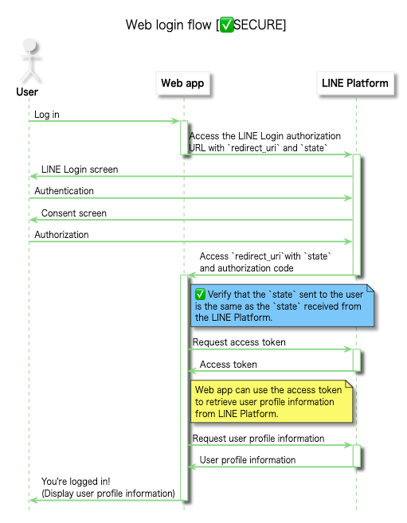

1. フロントエンド→バックエンドのログインエンドポイントへHttpリクエスト。/oauth2/authorization/{registrationId}がSpringSecurityがログイン認証を始める最初のエンドポイント
2. SpringSecurity→各プロバイダの認証エンドポイントを叩く。上記の{registrationId}にともなって、各resistrationに登録されている名前と一致するproviderのauthorizationUriを叩く。LINEの場合は、https://access.line.me/oauth2/v2.1/authorizeに必要なQueryをSpringSecurityが勝手につけてリクエスト送付
3. ユーザーが認証処理をすると、各プロバイダ→Spring Securityに必要なクエリをつけた状態（codeなど）で、登録されているredirectUriにリダイレクトされる
4. Spring Security→各プロバイダに必要な情報（codeなど）を付与してアクセストークン発行の依頼（postメソッド）。tokenUri: https://api.line.me/oauth2/v2.1/token
5. 各プロバイダ→SpringSecurityにアクセストークンなどを含んだ情報をredirect_uriへresponseする。
6. SpringSecurity→各プロバイダへアクセストークンを使用して、ユーザーの認証情報を取得依頼。userInfoUri: https://api.line.me/v2/profile
7. 各プロバイダ→SpringSecurityへ上記の情報をredirect_uriへresponseする。
8. 上記まで問題なければ、各SuccessHandlerが実行される（SuccessHandlerに入るタイミングでは２〜７が全て終わっていて、ユーザー情報はすでに持っている!!）
9. SuccessHandlerの最後にフロントエンドへredirectする。この時、SpringSecurityが「JSESSIONID」を作成してブラウザが保持する。これによってセッション管理されてUserの認証プロセスを完了する


```application.yml
spring:
  security:
    oauth2:
      client:
        registration:
          github:
            clientId: ${GITHUB_CLIENT_ID}
            clientSecret: ${GITHUB_SECRET_ID}
            scope: read:user
          line:
            clientId: ${LINE_CLIENT_ID}
            clientSecret: ${LINE_SECRET_ID}
            authorizationGrantType: authorization_code
            redirectUri: "{baseUrl}/login/oauth2/code/{registrationId}"
            scope: profile
        provider:
          line:
            authorizationUri: https://access.line.me/oauth2/v2.1/authorize
            tokenUri: https://api.line.me/oauth2/v2.1/token
            userInfoUri: https://api.line.me/v2/profile
            userNameAttribute: userId
#githubは共通のOAuthプロバイダとして、SpringBootが認識するので、登録不要
#          github:
#            authorization-uri: https://github.com/login/oauth/authorize
#            token-uri: https://github.com/login/oauth/access_token
#            user-info-uri: https://api.github.com/user


#Frontendから叩く場合は、/oauth2/authorization/{registrationId}がバックエンドの認証フローをスタートさせるトリガー
```
</details>


# コードの説明


<details>
<summary> 1. application.yml </summary>

- resistrationIdで各プロバイダを区別する
- 複数のプロバイダを使用する場合は、１つにredirectUriを定義すれば良い。最後に{resistrationId}とすることで、それぞれのプロバイダ用のリダイレクトUriが内部的に定義される
- scopeは各プロバイダに寄るので調べること
- フロントエンドから叩く際は、/oauth2/authorization/{registrationId}を叩く。各プロバイダでパスによって切り替えられる
- 共通OAuthプロバイダの場合（Github、Google、Facebookなど）は、SpringSecurityに既にプロバイダ情報はあるため、authorizationUriとかは特に定義しなくても問題ない。


```application.yml
spring:
  security:
    oauth2:
      client:
        registration:
          github:
            clientId: ${GITHUB_CLIENT_ID}
            clientSecret: ${GITHUB_SECRET_ID}
            scope: read:user
          line:
            clientId: ${LINE_CLIENT_ID}
            clientSecret: ${LINE_SECRET_ID}
            authorizationGrantType: authorization_code
            redirectUri: "{baseUrl}/login/oauth2/code/{registrationId}"
            scope: profile
        provider:
          line:
            authorizationUri: https://access.line.me/oauth2/v2.1/authorize
            tokenUri: https://api.line.me/oauth2/v2.1/token
            userInfoUri: https://api.line.me/v2/profile
            userNameAttribute: userId
#githubは共通のOAuthプロバイダとして、SpringBootが認識するので、登録不要
#          github:
#            authorization-uri: https://github.com/login/oauth/authorize
#            token-uri: https://github.com/login/oauth/access_token
#            user-info-uri: https://api.github.com/user


#Frontendから叩く場合は、/oauth2/authorization/{registrationId}がバックエンドの認証フローをスタートさせるトリガー
```

</details>

<details>
<summary> 2. SecurityConfiguration.kt </summary>

- 複数のプロバイダを切り替えれるように、各プロバイダ用のSuccessHandlerをBean登録しておく
- .csrfでポスト処理などの403エラーを回避できる（ただ、ざるになるので本当はだめ）
- requestMatchers().authentificated()で登録されているエンドポイントは認証されているかのチェックが入る。@AuthenticationPrincipalを使ってUser情報を取りたい場合は、このエンドポイント内にないとだめ

```kotlin
package com.example.backend.auth.config

import com.example.backend.auth.handler.common.AppCustomeAuthenticationSuccessHandler
import com.example.backend.auth.handler.provider.GithubAuthenticationSuccessHandler
import com.example.backend.auth.handler.provider.LineAuthenticationSuccessHandler
import com.example.backend.service.UserService
import org.springframework.context.annotation.Bean
import org.springframework.context.annotation.Configuration
import org.springframework.security.config.annotation.method.configuration.EnableMethodSecurity
import org.springframework.security.config.annotation.web.builders.HttpSecurity
import org.springframework.security.config.annotation.web.configuration.EnableWebSecurity
import org.springframework.security.web.SecurityFilterChain
import org.springframework.security.web.authentication.AuthenticationSuccessHandler

@EnableWebSecurity
@EnableMethodSecurity(prePostEnabled = true)
@Configuration
class SecurityConfiguration (
  val userService: UserService
) {
  @Bean
  fun authenticationSuccessHandler(): AuthenticationSuccessHandler {
    return AppCustomeAuthenticationSuccessHandler(
      listOf(
        LineAuthenticationSuccessHandler(userService),
        GithubAuthenticationSuccessHandler(userService)
      )
    )
  }

  @Bean
  fun filterChain(http: HttpSecurity): SecurityFilterChain {
    http
      .csrf().disable()
      .authorizeHttpRequests {
        it.requestMatchers("/api/**")
          .authenticated()
        it.anyRequest()
          .permitAll()
      }
      .oauth2Login {
        it.successHandler(authenticationSuccessHandler())
      }
    return http.build()
  }
}

```

</details>

<details>
<summary> 3. CommonAuthenticationSuccessHandler.kt </summary>

- 各プロバイダーによらず、共通で処理したい部分を記載する。各プロバイダのクラスに継承をして欲しいので、"abstract"の抽象クラスにしている
- 認証成功時に、どのサクセスハンドラーを使用するかを決定するために、各サクセスハンドラーのsupportsメソッドをAppAuthentication SuccessHandlerが呼ぶ。lineやgithubを決める
- getOidやgetDisplayNameなど各プロバイダごとでアクセスするキーが変わるものは abstract関数にしておいて、継承先でのoverrideを強制する
- 認証プロセス終了時に自動で、①supporsメソッド→②onAuthenticationSuccessが呼ばれる
- 「SecurityContextHolder.getContext().authentication = newAuthentication」の行で、認証後のuser情報を登録して、@AuthenticationPrincipalでアクセスできるようになる。


```kotlin
package com.example.backend.auth.handler.common

import com.example.backend.auth.model.CustomOAuth2User
import com.example.backend.service.UserService
import jakarta.servlet.http.HttpServletRequest
import jakarta.servlet.http.HttpServletResponse
import org.springframework.security.core.Authentication
import org.springframework.security.core.context.SecurityContextHolder
import org.springframework.security.oauth2.client.authentication.OAuth2AuthenticationToken
import org.springframework.security.oauth2.core.user.OAuth2User

abstract class CommonAuthenticationSuccessHandler(
  private val userService: UserService,
  private val clientRegistrationId: String
) : AppAuthenticationSuccessHandler {

  override fun supports(oauth2Authentication: OAuth2AuthenticationToken): Boolean {
    return clientRegistrationId == oauth2Authentication.authorizedClientRegistrationId
  }

  override fun onAuthenticationSuccess(
    request: HttpServletRequest?,
    response: HttpServletResponse,
    authentication: Authentication
  ) {
    val principal = authentication.principal as OAuth2User
    val oAuth2AuthenticationToken = authentication as OAuth2AuthenticationToken
    val oid = getOid(principal)
    val displayName = getDisplayName(principal)
    val res = userService.getOrCreateUserService(oid = oid, name = displayName)
    val newAuthentication = OAuth2AuthenticationToken(
      CustomOAuth2User(
        userId = res.id.toString(),
        oid = oid,
        name = displayName,
        authorities = principal.authorities,
      ),
      authentication.authorities,
      oAuth2AuthenticationToken.authorizedClientRegistrationId
    )
    SecurityContextHolder.getContext().authentication = newAuthentication
    val redirectUrl = System.getenv("AFTER_AUTH_REDIRECT_URL") ?: "hogehoge"
    response.sendRedirect(redirectUrl)
  }

  abstract fun getOid(principal: OAuth2User): String
  abstract fun getDisplayName(principal: OAuth2User): String
}
```

</details>

<details>
<summary> 4. LineAuthenticationSuccessHandler.kt </summary>

- 共通部分を持てるように、CommonAuthenticationSuccessHandlerクラスを継承する
- getOidや、getDisplanNameなど各プロバイダでアクセスするキーが異なる部分をこのクラスが担う。


```kotlin
package com.example.backend.auth.handler.provider

import com.example.backend.auth.handler.common.CommonAuthenticationSuccessHandler
import com.example.backend.service.UserService
import org.springframework.security.oauth2.core.user.OAuth2User

class LineAuthenticationSuccessHandler(userService: UserService) : CommonAuthenticationSuccessHandler(userService, "line") {
  override fun getOid(principal: OAuth2User): String = principal.getAttribute<String>("userId") ?: throw Exception("There is no userId")
  override fun getDisplayName(principal: OAuth2User): String = principal.getAttribute<String>("displayName") ?: throw Exception("There is no name")
}
```

</details>

<details>
<summary> 5. CustomOAuth2User.kt </summary>

- attributesのところで、どのキーをPrincipalとして登録するかを定義する。増やしたい場合は増やせる

```kotlin
package com.example.backend.auth.model

import org.springframework.security.core.AuthenticatedPrincipal
import org.springframework.security.core.GrantedAuthority
import org.springframework.security.oauth2.core.user.OAuth2User
import java.io.Serializable
import java.util.UUID

class CustomOAuth2User(
  private val authorities: Collection<GrantedAuthority>,
  private val userId: String,
  private val oid: String,
  private val name: String,
) : OAuth2User {
  private val attributes: Map<String, Any> = mapOf("userId" to userId, "oid" to oid, "name" to name)

  override fun getName(): String {
    return name
  }

  override fun getAttributes(): Map<String, Any> {
    return attributes
  }

  override fun getAuthorities(): Collection<GrantedAuthority> {
    return authorities
  }
}

```

</details>


<details>
<summary> 6. AuthController.kt </summary>

- 各メソッドの引数で@AuthenticationPrincipalをつけると、認証されたuser情報が取れる
- user情報へのアクセス方法は user.getAttribute("取りたいキー")でGetできる

```kotlin
package com.example.backend.controller

import com.example.backend.auth.model.CustomOAuth2User
import com.example.backend.model.response.ResponceUserInfo
import com.example.backend.service.UserService
import org.springframework.security.core.annotation.AuthenticationPrincipal
import org.springframework.web.bind.annotation.GetMapping
import org.springframework.web.bind.annotation.RequestMapping
import org.springframework.web.bind.annotation.RestController

@RestController
@RequestMapping("/api/auth")
class AuthController (
  val userService: UserService
) {
  @GetMapping("/check-auth")
  fun checkAuth (
    @AuthenticationPrincipal user: CustomOAuth2User,
  ) {
    println("userId : " + user.getAttribute("oid"))
  }

}
```

</details>


# ChatGPT

<details>
<summary> 1. 起動時に読み込まれるアノテーションに関して</summary>

- 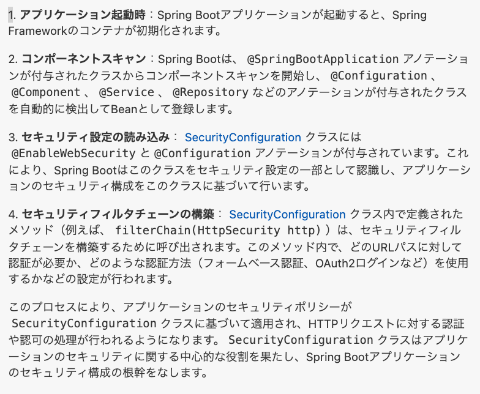
</details>

<details>
<summary> 2. application.ymlの設定に関して</summary>

- 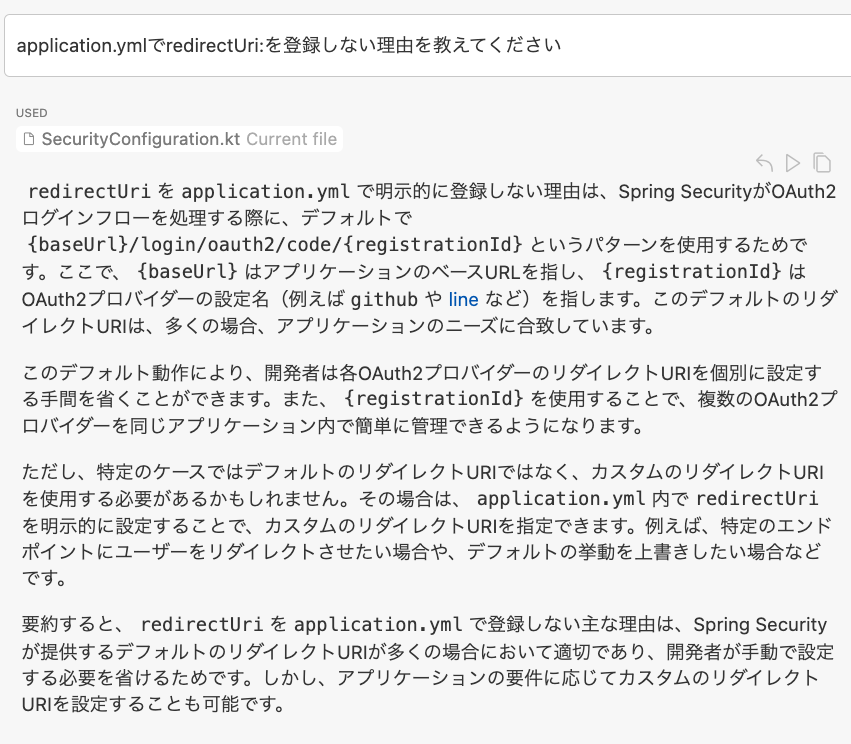
- 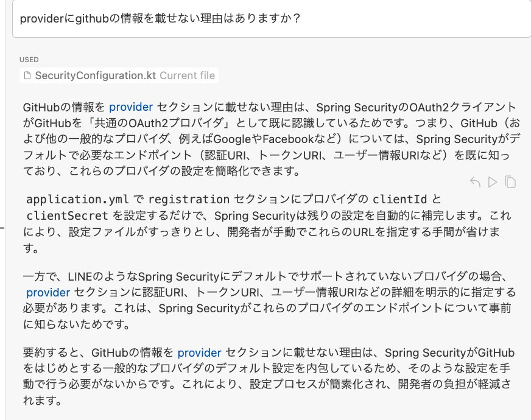
</details>

<details>
<summary> 3. 認証プロセスに関して</summary>

- 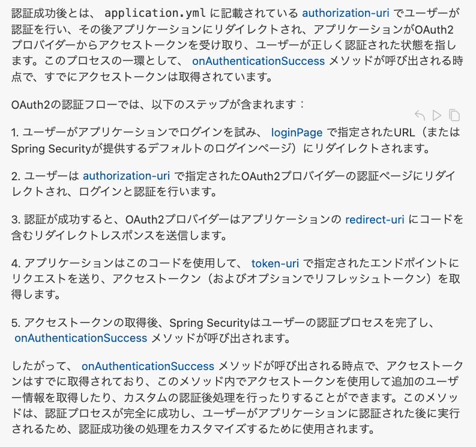
- 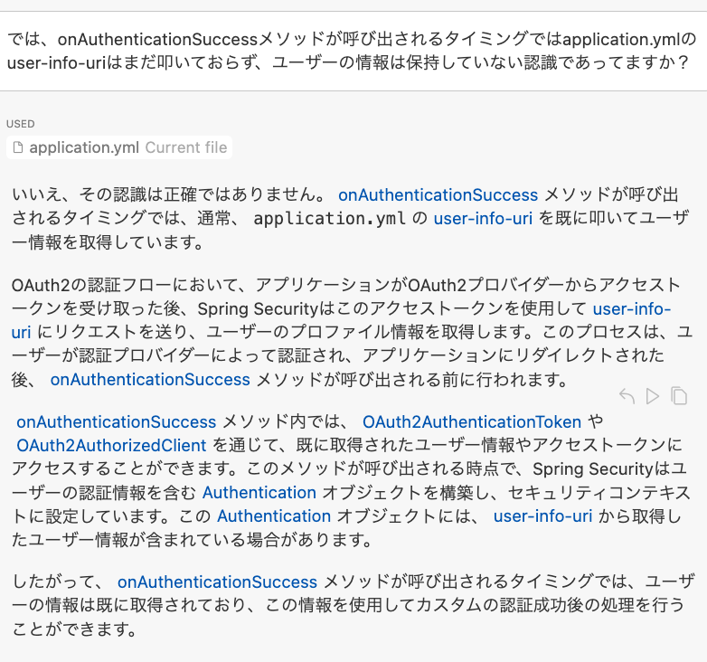
</details>

<details>
<summary> 4. SuccessHandlerの切り替えについて</summary>

- 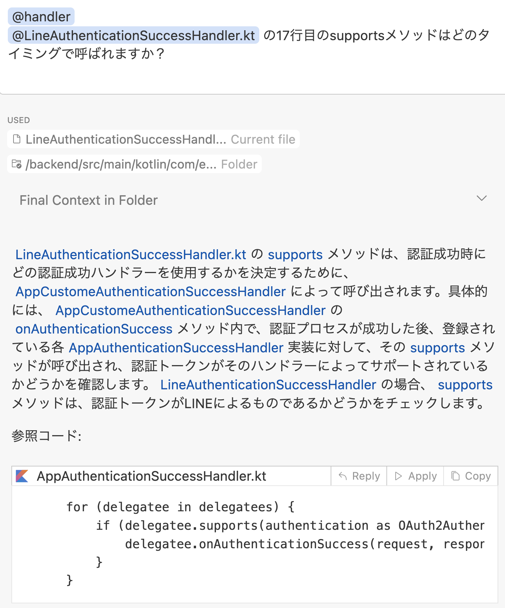
</details>

<details>
<summary> 5. mockkのrelaxed = true について</summary>

- 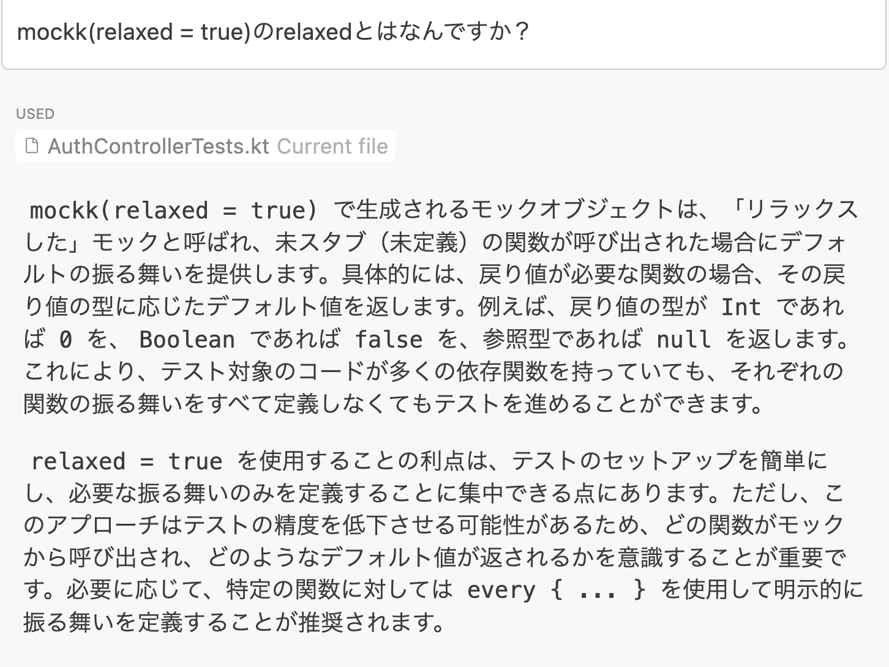
</details>

<details>
<summary> 6. slot / capture でメソッド呼び出しで渡された引数をキャプチャーする</summary>

- 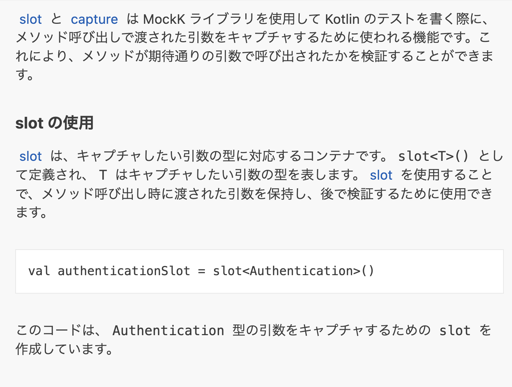
- 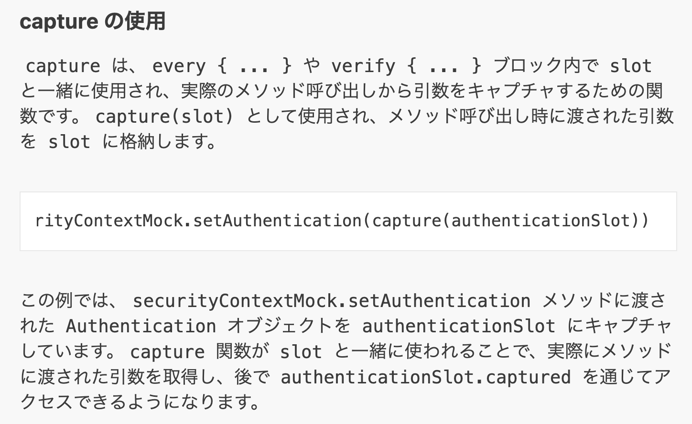
- 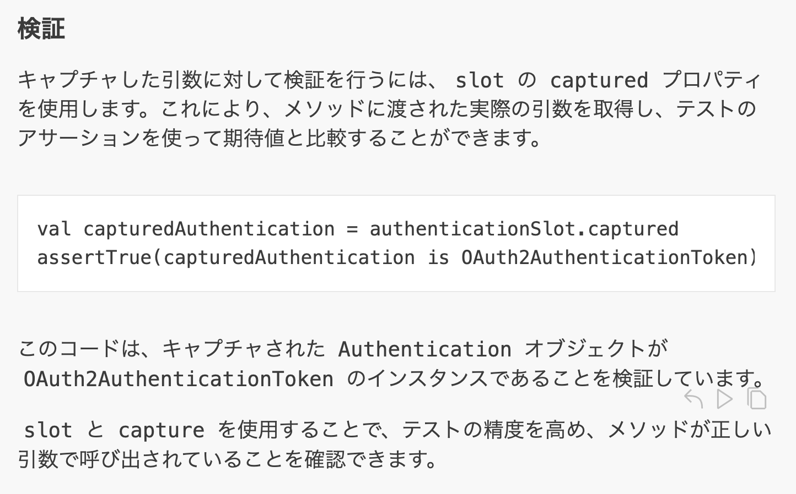
</details>


# 参考
- [githubログイン実装例](https://tech.asoview.co.jp/entry/2021/12/09/000000)
- [OAuthの説明](https://qiita.com/TakahikoKawasaki/items/e37caf50776e00e733be)
- [Googleでログインガイドライン](https://developers.google.com/identity/branding-guidelines?fbclid=IwAR0oyedruG1mHbETsSGIh-w1cIUU7ya4y2BTXVvR1fezUuR6nAHz_H3yL2s&hl=ja)
- [LINE DEVELOPERS 公式ドキュメント](https://developers.line.biz/ja/reference/line-login/)
- [LINEボタンのルール](https://developers.line.biz/ja/docs/line-login/login-button/)
